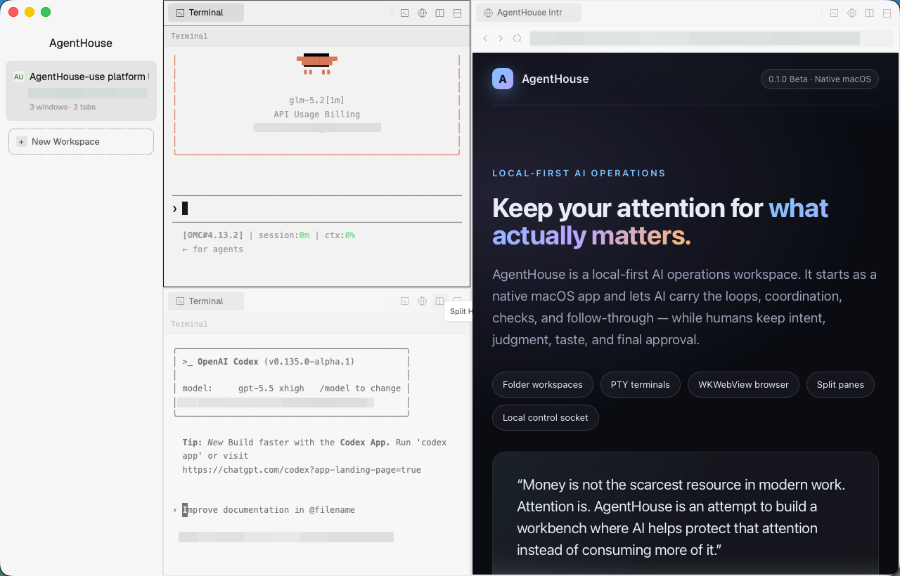

# AgentHouse



AgentHouse is a local-first AI operations workspace for people building and
running real businesses.

AI is becoming smarter than any single person at more and more bounded tasks.
The question is no longer whether AI can answer, write, browse, calculate, or
operate tools. The question is whether humans can build a workspace where that
intelligence works with us without stealing the one resource our lives are made
of: attention.

AgentHouse is a small step toward that future. It is AI Native, human-shared,
and local-first. It gives humans and agents the same work surface: folders,
terminals, browser tabs, panes, sessions, blocks, and a local control boundary.
The machine can carry loops, checks, follow-ups, and coordination. The human
keeps intent, judgment, taste, approval, and imagination.

We are building for the day when an AI assistant can help a person operate a
business end to end: watch channels, prepare drafts, inspect data, follow up
with customers, assemble reports, notice exceptions, and keep work moving while
the person has more time for strategy, relationships, creation, and rest.

Let's build toward that future, one local workspace at a time.

## What It Is

The current `0.1.0` Beta is a small, inspectable macOS product slice:

- folder-backed workspaces;
- PTY-backed terminal tabs for local tools and agent CLIs;
- native WKWebView browser tabs;
- split work surfaces for side-by-side operations;
- SQLite persistence for workspace, session, and control state;
- a local JSONL control socket for agent inspection and smoke testing;
- macOS `.app` bundle generation.

AgentHouse is local-first. The current control socket is local-only and is not a
remote automation API.

## What It Is Not

AgentHouse is not trying to be another IDE. The terminal and browser are
starting points because many business and operations workflows already pass
through them. The product direction is an AI operations center for real
business work: monitoring, drafting, checking, coordinating, escalating, and
closing loops.

The `0.1.0` Beta does not include cross-platform desktop support, remote control
APIs, a full file manager, browser identity tooling, or production signing and
notarization.

## Roadmap

The roadmap is intentionally staged.

### 1. Local Workbench

Make the core workspace reliable: folders, terminals, browser tabs, panes,
session state, persistence, and local inspection.

### 2. Agent Orchestration

Turn individual agent sessions into coordinated work: assign roles, route
context, forward blocks, track status, request approval, and make handoffs
observable.

### 3. Automation Operations Center

Move from isolated sessions to repeatable business operations: scheduled checks,
channel monitoring, content operations, customer follow-up, reporting,
exception queues, and human approval flows.

### 4. Attention Layer

Help people see what needs attention and what can wait. The long-term product
should reduce interruption, surface meaningful changes, preserve context, and
let humans spend attention where it compounds.

See `docs/ROADMAP.md` for the more detailed release roadmap.

## Requirements

- macOS 13 or newer.
- Rust 1.95 or newer.
- Xcode Command Line Tools for native macOS linking and `iconutil`/`sips`
  bundle assets.

A first clean build needs GitHub access unless the pinned Git dependencies are
already cached by Cargo.

## Build And Run

```sh
cargo build -p agenthouse
cargo run -p agenthouse
```

To create a macOS app bundle after building:

```sh
cargo run -p xtask -- macos-bundle --profile debug
```

The bundle is written to `target/debug/AgentHouse.app`. Use `--profile release`
after building `agenthouse` with `--release`.

## Control Harness

`ah-use` talks to the running app through the local JSONL control socket.
Useful checks:

```sh
cargo run -p ah-use -- ping
cargo run -p ah-use -- inspect snapshot
cargo run -p ah-use -- platform-loop
cargo run -p ah-use -- window-api-loop
```

The control socket is local-only and is not an authenticated network API.

## Contributing And Security

- Agent instructions: `AGENTS.md`
- Development workflow: `skills/agenthouse-development/SKILL.md`
- Contribution workflow: `CONTRIBUTING.md`
- Security reporting and current local-control boundary: `SECURITY.md`
- Third-party dependency and bundled asset notices: `THIRD_PARTY_NOTICES.md`

## Repository Layout

```text
crates/ah-core            Shared IDs, timestamps, typed foundations
crates/ah-workspace       Workspace, window, tab, and layout model
crates/ah-session         Session metadata and lifecycle state
crates/ah-terminal        PTY and terminal grid boundary
crates/ah-block           Structured work/block model
crates/ah-web             Browser backend trait and lightweight web state
crates/ah-webview-macos   macOS WKWebView backend
crates/ah-store           SQLite persistence boundary
crates/ah-control         JSON-serializable control protocol
crates/ah-use             External control harness and smoke scenarios
crates/agenthouse         GPUI application
xtask/                    Project automation
docs/                     Architecture, roadmap, and release notes
skills/                   Project-specific development workflow
```

## License

AgentHouse source code is licensed under Apache-2.0. See `LICENSE`.

Third-party dependencies and bundled assets remain under their own licenses.
See `THIRD_PARTY_NOTICES.md`.
